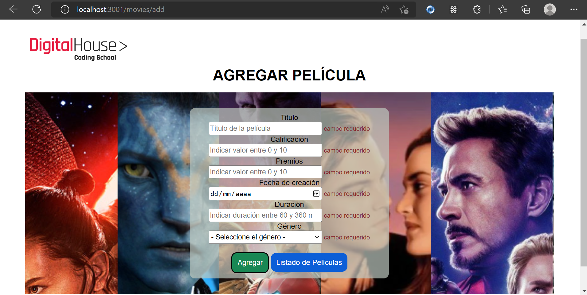

### Interactuando con formularios
#### Validar un formualrio del lado del cliente es uno de los desafíos más comunes de Javascript y se puede hacer de diversas maneras. En el caso de que los datos que se introduzcan en los campos del formulario son correctos, se realiza el envío hacia el servidor. En caso contrario, se informa al usuario qué campo no está cumplientdo con los requisitos establecidos. 
#### Esta validación del lado del front-end es particularmente importante para no envíar datos erroneos a la base de datos y/o estar constantemente haciendo request al servidor, sobrecargándolo. Pero OJO! Estas validaciones NO reemplazan a las validaciones del lado del back-end. Solo son un complemento adicional y necesario para dar cuenta al usuario de los datos que debe agregar y cómo se aceptan estos datos.
#### Aqui una muestra, si se quiere enviar el formulario vacío, saltan las validaciones del front-end, envíando un mensaje al usuario, del error existente. En este caso, que los campos deben tener informacion o son requeridos para así agregar la nueva película. 
